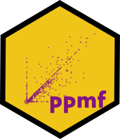

<!-- README.md is generated from README.Rmd. Please edit that file -->

```{r, include = FALSE}
knitr::opts_chunk$set(
  collapse = TRUE,
  comment = "#>",
  fig.path = "man/figures/README-",
  out.width = "100%"
)
```

# ppmf <a href='https://christophertkenny.com/ppmf/'></a>

<!-- badges: start -->
[](https://github.com/christopherkenny/ppmf/actions)
[](https://github.com/christopherkenny/ppmf/actions/workflows/R-CMD-check.yaml)
<!-- badges: end -->

The goal of `ppmf` is to convert Census Privacy Protected Microdata Files into somewhat wider data aggregated to a geographic level.

## Installation

You can install the development version from [GitHub](https://github.com/) with:

``` r
# install.packages("remotes")
remotes::install_github("christopherkenny/ppmf")
```
## Basics
Load the package:
```{r example, eval = FALSE}
library(ppmf)
```

Download and read data with:
```{r, eval = FALSE}
path <- download_ppmf(dsn = 'filename.csv', dir = 'some/directory', version = '19')
al <- read_ppmf(state = 'AL', path = path)
```
Version '19' reflects the 19.61 finalized parameters used again for the 2020 Census.


For future use, I recommend storing the path to the data for future sessions using:
```{r, eval = FALSE}
add_pmmf19_path(path)
```
Then the path can be recovered with:
```{r, eval = FALSE}
path19 <- Sys.getenv('ppmf19')
```


Once you've read in what you want, you can aggregate it to the right level:
```{r, eval = FALSE}
al <- al |> add_geoid()
blocks <- agg(al)
```

And aggregated data can use the GEOID to merge with shapefiles:
```{r, eval = FALSE}
library(dplyr) # to clean up the data

shp <- tigris::blocks('AL', year = 2010) |> 
  select(GEOID10, geometry) |> rename(GEOID = GEOID10)
shp <- shp |> left_join(blocks, by = 'GEOID')

# always clean shp!
shp[is.na(shp)] <- 0
```

--- 
For users with the newest package version, there is an added dependency on [`censable`](https://christophertkenny.com/censable/), which allows for an easier workflow. If you've used the `add_pmmf*_path()` workflow suggested, you don't even need to supply the paths!

This will not just read the `ppmf` data, it will merge it with 2010 Census populations (by major race/ethnicity grouping) and add the corresponding geometries.

```{r, eval = FALSE}
al <- read_merge_ppmf('AL', level = 'block', versions = '19')
```

